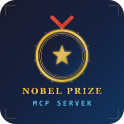

<p align="center">
  
</p>

<h1 align="center">Nobel Prize MCP Server</h1>

[](https://www.npmjs.com/package/nobel-prize-mcp-server)
[](../../LICENSE)
[](https://nodejs.org)

A **Model Context Protocol (MCP) server** providing AI assistants with structured access to the [Nobel Prize API v2.1](https://api.nobelprize.org/2.1/). Covers all laureates, prizes, and categories from **1901 to present**.

## 📦 Installation

### Use with npx (no install)

```bash
npx nobel-prize-mcp-server
```

### Global install

```bash
npm install -g nobel-prize-mcp-server
nobel-prize-mcp-server
```

### As a project dependency

```bash
npm install nobel-prize-mcp-server
```

## ⚙️ Configuration

Configure via environment variables (all optional):

| Variable | Default | Description |
|----------|---------|-------------|
| `NOBEL_MCP_BASE_URL` | `https://api.nobelprize.org/2.1` | API base URL |
| `NOBEL_MCP_CACHE_TTL_MS` | `86400000` (24h) | Cache TTL in ms |
| `NOBEL_MCP_CACHE_MAX_SIZE` | `200` | Max cache entries |
| `NOBEL_MCP_TIMEOUT_MS` | `10000` | HTTP request timeout |
| `NOBEL_MCP_LANGUAGE` | `en` | Language (`en`, `se`, `no`) |
| `NOBEL_MCP_PER_PAGE` | `25` | Results per page |

### Claude Desktop (`claude_desktop_config.json`)

```json
{
  "mcpServers": {
    "nobel-prize": {
      "command": "npx",
      "args": ["-y", "nobel-prize-mcp-server"],
      "env": {
        "NOBEL_MCP_CACHE_TTL_MS": "86400000"
      }
    }
  }
}
```

### VS Code MCP Config (`.vscode/mcp.json`)

```json
{
  "servers": {
    "nobel-prize": {
      "type": "stdio",
      "command": "npx",
      "args": ["-y", "nobel-prize-mcp-server"]
    }
  }
}
```

## 🛠️ Tools

### Laureate Tools

#### `nobel_get_laureate`
Get detailed laureate information by name or ID.

```
Input: { "nameOrId": "Einstein" }  or  { "nameOrId": 26 }

Output:
🏆 Albert Einstein (1879–1955)
   Born: 1879-03-14, Ulm, Germany
   Died: 1955-04-18, Princeton, NJ, USA

   Nobel Prize in The Nobel Prize in Physics, 1921
   Motivation: "for his discovery of the law of the photoelectric effect"
   Share: sole recipient
   Affiliation: Kaiser-Wilhelm-Institut, Berlin, Germany
```

#### `nobel_search_laureates`
Search by name, gender, country, category, or year range.

```
Input: { "gender": "female", "category": "phy", "limit": 5 }
```

### Prize Tools

#### `nobel_get_prizes`
Search prizes by category, year, or year range.

```
Input: { "category": "phy", "year": 2023 }
```

#### `nobel_get_prize_by_year`
Get all prizes for a specific year.

```
Input: { "year": 2023 }
```

### Analysis Tools

#### `nobel_list_categories`
List all 6 Nobel Prize categories with statistics.

#### `nobel_get_category_stats`
Detailed statistics for a category including decade-by-decade breakdown.

```
Input: { "category": "phy" }
```

#### `nobel_get_country_stats`
Nobel Prize rankings by country with per-category breakdown.

```
Input: { "country": "United States" }  or  { "limit": 10 }
```

#### `nobel_get_trends`
Historical trends analysis: age at award, gender distribution, shared vs sole prizes, country shifts.

```
Input: { "metric": "gender" }
Input: { "metric": "age", "category": "phy" }
Input: { "metric": "shared" }
Input: { "metric": "country", "decade": 2020 }
```

## 📄 License

[MIT](../../LICENSE) © bhayanak
